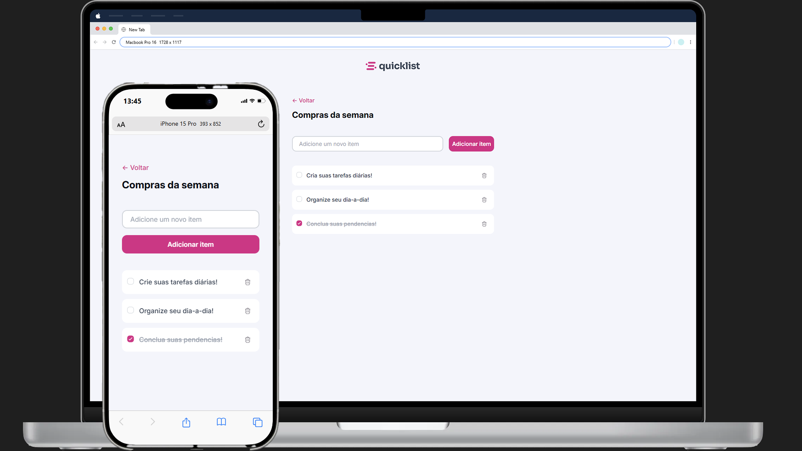

  
  <h1 align="center">Quicklist</h1>

Bem-vindo ao Quicklist, uma aplicação incrível para gerenciar suas tarefas diárias com eficiência. Esta aplicação foi projetada para oferecer uma experiência intuitiva e funcionalidades avançadas para melhorar a organização e produtividade.

     

### 🚀 Funcionalidades Principais

- **Adição de Tarefas**: Adicione facilmente novas tarefas com descrições detalhadas.
- **Marcação de Conclusão**: Marque tarefas como concluídas para um acompanhamento visual do progresso.

### 🛠️ Tecnologias Utilizadas

 
 
 

### 💻 Live Preview

Confira a demonstração do projeto [aqui](https://quicklistapp.vercel.app/).

### 🖇️ Contribuindo
Estamos abertos a contribuições para tornar este aplicativo ainda mais incrível! Se você tiver sugestões de recursos, encontrar bugs ou quiser contribuir de outra forma, por favor, abra uma issue ou envie um pull request.

### 📌 Feedback

Adoraríamos ouvir sua opinião sobre o Quicklist. Se você tiver algum feedback, sugestões ou problemas, sinta-se à vontade para abrir uma issue ou entrar em contato diretamente.
  
### 📄 Licença

Este projeto é licenciado sob a [Licença MIT](LICENSE.md),o que significa que você pode usá-lo, modificar e distribuir conforme desejar.

---

Feito com ♥ by [Victor Oliveira](https://github.com/vctrhugoop/)

(<a href="#readme-top">back to top</a>)
